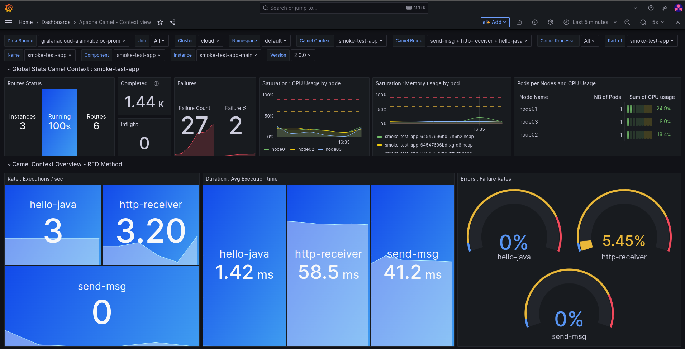

# Archetypes & Monitoring Tools for Java/Apache Camel developers

This repo contains archetypes that should be useful to camel developers that don't want to start with common things already included in their projects such as monitoring, circuit breaking, swagger ui etc..

It also contains the a comprehensive Grafana Dashboard for performance monitoring on metrics collected through Prometheus.

## Create a Spring Boot Camel Project

The following is a Spring Boot archetype

```
mvn archetype:generate \
    -DarchetypeGroupId=io.github.alainpham \
    -DarchetypeArtifactId=spring-boot-camel \
    -DarchetypeCatalog=local \
    -DarchetypeVersion=1.0.0
```

## Create a Quarkus Camel Project

The following is a Quarkus archetype

```
mvn archetype:generate \
    -DarchetypeGroupId=io.github.alainpham \
    -DarchetypeArtifactId=quarkus-camel \
    -DarchetypeCatalog=local \
    -DarchetypeVersion=1.0.0
```

## Create a Plain Java Project

```
mvn archetype:generate \
    -DarchetypeGroupId=io.github.alainpham \
    -DarchetypeArtifactId=plain-java \
    -DarchetypeCatalog=local \
    -DarchetypeVersion=1.0.0
```

## Grafana Dashboard For Camel Monitoring

The dashboard that you can import can be found [here](camel-monitoring/dashboards-for-import/Camel%20Dashboard%20-%20Context%20View.json)


It gives comprehensive metrics for performance monitoring. It focuses on monitoring route execution rate and average executions times that is broken down to processors & routes. You can use it to find your bottlenecks and detect degradations in quality of service.

Videos : 
Here : http://www.youtube.com/watch?v=0LDgv1nIk-Y
or here : https://odysee.com/@alainpham:8/apache-camel-monitoring-prometheus-grafana:c 

[](http://www.youtube.com/watch?v=0LDgv1nIk-Y)

## Install Prometheus and Grafana Kubernetes/Openshift Namespace for monitoring

Use these commands if you want to quickly test the archetype out including some monitoring

```
export TARGET_NS=YOUR_TARGET_NAMESPACE_HERE

oc project ${TARGET_NS}

cat camel-monitoring/prometheus-local.yaml | sed -E "s/TARGET_NAMESPACE/${TARGET_NS}/"| oc apply -f -

oc create configmap grafana-dashboards --from-file=camel-monitoring/dashboards

oc apply -f camel-monitoring/grafana.yaml
```

alternative : prometheus with the operator

```
export TARGET_NS=YOUR_TARGET_NAMESPACE_HERE

cat prometheus-with-operator/operator-group.yml | sed -E "s/TARGET_NAMESPACE/${TARGET_NS}/"| oc apply -f -
cat prometheus-with-operator/prom-sub.yml | sed -E "s/TARGET_NAMESPACE/${TARGET_NS}/"| oc apply -f -
cat prometheus-with-operator/prom.yml | sed -E "s/TARGET_NAMESPACE/${TARGET_NS}/"| oc apply -f -
cat prometheus-with-operator/strimzi-pod-monitor.yaml | sed -E "s/TARGET_NAMESPACE/${TARGET_NS}/"| oc apply -f -
cat prometheus-with-operator/camel-pod-monitor.yml | sed -E "s/TARGET_NAMESPACE/${TARGET_NS}/"| oc apply -f -
cat prometheus-with-operator/artemis-pod-monitor.yml | sed -E "s/TARGET_NAMESPACE/${TARGET_NS}/"| oc apply -f -

```

## Install Prometheus & Grafana on local docker engine for testing

Follow these instructions linked here to have Prometheus and Grafana running as local docker containers. 

https://github.com/alainpham/dev-env-scripts#monitoring

By editing the prometheus config we can set static targets on your local env to emulate the behavior of auto discovered pods on Kubernetes.

## Current versions for plain java pojects

| Components                 | Version        |
|----------------------------|----------------|
| java                       | 11             |
| camel-version              | 3.17.0         |
| maven-compiler-plugin      | 3.10.1         |
| maven-dependency-plugin    | 3.3.0          |
| maven-jar-plugin           | 3.2.2          |
| logback-version            | 1.2.9          |


## Current versions for spring boot used

| Components                 | Version        |
|----------------------------|----------------|
| java                       | 11             |
| maven-compiler-plugin      | 3.10.1         |
| camel-version              | 3.18.0         |
| spring-boot-version        | 2.7.2          |
| swagger-ui-version         | 3.52.5         |
| swagger-codegen-version    | 3.5.3          |
| cxf-codegen-plugin-version | 3.5.3          |
| logstash-encoder-version   | 7.2            |
| webjars-locator-version    | 0.45           |
| hawtio-springboot-version  | 2.15.0         |
| jmx_prometheus_javaagent   | 0.17.0         | 
| run-java-version           | 1.3.8          |
| temurin-image-version      | 11.0.15_10-jre |


## Current versions for quarkus used

| Components                 | Version        |
|----------------------------|----------------|
| java                       | 11             |
| camel-version              | 3.18.0         |
| quarkus-version            | 2.11.1.Final   |
| maven-compiler-plugin      | 3.8.1          |
| surefire-plugin-version    | 3.0.0-M7       |
| ubi-image-version          | 1.11           |
| temurin-image-version      | 11.0.15_10-jre |

## Next steps for this small project

* Build a Dashboard for Camel Quarkus with the microprofile metrics componenents. This will be great for SLA management as their are some cool metrics like quantiles on execution time.
